# ARCHITECTURE & UX SIMPLIFICATION AUDIT
**Mode: Forensic Read-Only Audit & Target Architecture Specification**  
**Date: September 2026**  
**Status: FORENSIC AUDIT COMPLETE — ZERO PRODUCTION CODE MUTATED**

---

## 1. Executive Summary

Over successive development cycles, this quantitative trading and machine learning platform has accumulated significant industrial capabilities:
- Multi-factor ML ensembles (RandomForest, LightGBM, ExtraTrees, CatBoost)
- Out-of-sample TimeSeriesSplit validation and 10-year walk-forward backtesting
- 4-stage Indian equity universe expansion (52 liquid equities up to 500+ NIFTY universe)
- Strict mathematical promotion governance (hurdles on F1, Sharpe, Max Drawdown, sample size)
- Virtual recommendation tracking with automated SL/TP monitoring
- Real-time SSE telemetry, background workers, and Telegram reporting

**The Problem**:
While the underlying quantitative foundation is exceptionally strong, the system's architecture has become **severely fragmented**:
1. **Frontend Overgrowth**: 15 distinct pages, over 250 interactive buttons/handlers, and multiple disjoint sub-labs (`DataLab.jsx` with 3,548 lines, `AutonomousResearchLab.jsx` with 2,656 lines, `MLLab.jsx` with 991 lines).
2. **Duplicated Scanning**: `IntradayScanner.jsx` (384 lines) and `SwingScanner.jsx` (384 lines) are **95% identical code clones** running separate UI state, separate SSE loops, and separate modal triggers.
3. **Four Competing Research Subsystems**:
   - Legacy Orchestrator (`legacy_engine.py` + `orchestrator_jobs` table) — constantly throwing background exceptions because its table was superseded.
   - Job Manager (`research_job_manager.py` + `research_jobs` table).
   - Qlib Signal Discovery V1, V2, and V3 (`qlib_research.py` + 13 separate research tables).
   - Autonomous Research Lab V1 (`research_orchestrator.py` + `research_missions`, `research_candidate_vault`).
4. **Data Layer Fragmentation**: 46 distinct SQLite tables defined across 20+ files; multiple conflicting `get_db_path()` definitions; ad-hoc ticker validation in 8 different files.
5. **Operational Fragility**: Certain buttons trigger backend endpoints that look for missing tables or use relative paths (e.g. `'backend/models/intraday/champion_ensemble.pkl'`).

**The Goal**:
This audit establishes the blueprint to **dramatically simplify the UX into 5 unified views**, unify the backend behind **single authoritative gateways**, eliminate broken/dead legacy code, and introduce **One-Click Autonomous Workflows**—while guaranteeing **100% data preservation, zero loss of safety, and byte-for-byte Champion preservation**.

---

## 2. Current Architecture Map

```mermaid
graph TB
    subgraph Frontend ["Current Fragmented Frontend (15 Routes / 250+ Buttons)"]
        UI_Dash["Dashboard (/)"]
        UI_Scan1["Intraday Scanner (/ai-scan)"]
        UI_Scan2["Swing Scanner (/swing-scan)"]
        UI_Scan3["Watchlist Scanner (/scanner)"]
        UI_Strat1["Custom Strategy (/strategy/new)"]
        UI_Strat2["Strategy Library (/strategy/library)"]
        UI_Strat3["Saved Strategies (/saved)"]
        UI_Opt["Optimizer (/optimizer - Unrouted)"]
        UI_Lab1["ML Lab (/ml-lab: 5 sub-tabs)"]
        UI_Lab2["Data Lab (/data-lab: 3,548 lines)"]
        UI_Lab3["Autonomous Research (/research-autopilot)"]
        UI_Dump["System Cache Dump (/data-dump)"]
        UI_Audit["System Audit (/audit)"]
        UI_Prof["Settings & Profile (/profile)"]
        UI_Help["Help Center (/help)"]
    end

    subgraph API ["Current API Surface (15 Routers / 176 Endpoints)"]
        R_ML["/api/ml (intraday_ml, swing_ml, ml_lab, ml_backtest)"]
        R_QLIB["/api/ml/qlib (qlib_research V1, V2, V3)"]
        R_RES["/api/research-autopilot (research_autopilot)"]
        R_DATA["/api/data-lab & /api/coverage (data_lab)"]
        R_MKT["/api/market (market)"]
        R_WL["/api/watchlist (watchlist, watchlist_scanner)"]
        R_BRK["/api/broker (broker)"]
        R_SET["/api/settings (settings)"]
        R_DASH["/api/dashboard (dashboard_intelligence)"]
        R_FNO["/api/fno (fno)"]
    end

    subgraph Engines ["Fragmented Backend Engines (Competing Systems)"]
        E_Scan1["Intraday Scan Loop"]
        E_Scan2["Swing Scan Loop"]
        E_WL["Batch Watchlist Scanner"]
        E_LegOrch["Legacy Engine (Broken: no orchestrator_jobs table)"]
        E_ResOrch["New Research Orchestrator (Missions, Vault)"]
        E_Qlib["Qlib V1/V2/V3 Signal Engines"]
        E_FwdSim["Forward Simulation 2.0 Engine"]
        E_TradeEval["evaluate_ml_history (yfinance batch)"]
        E_Bot["active_trade_tracker (APScheduler 5m)"]
    end

    subgraph Storage ["Database Fragmentation (46 Tables in SQLite)"]
        DB_Core["market_data.db"]
        T_Trade["ml_trade_history (72 rows)"]
        T_Vault["research_candidate_vault (686 rows)"]
        T_Missions["research_missions (192 rows)"]
        T_Ledger["research_experiments_ledger (294 rows)"]
        T_Qlib["13 Qlib V1/V2/V3 Tables"]
        T_FwdSim["7 Forward Simulation Tables"]
        T_LegJobs["Missing orchestrator_jobs (Exceptions)"]
    end

    UI_Scan1 --> R_ML
    UI_Scan2 --> R_ML
    UI_Scan3 --> R_WL
    UI_Lab1 --> R_ML
    UI_Lab1 --> R_QLIB
    UI_Lab2 --> R_DATA
    UI_Lab3 --> R_RES

    R_ML --> E_Scan1
    R_ML --> E_Scan2
    R_WL --> E_WL
    R_DATA --> E_LegOrch
    R_DATA --> E_FwdSim
    R_RES --> E_ResOrch
    R_QLIB --> E_Qlib

    E_Scan1 --> T_Trade
    E_Scan2 --> T_Trade
    E_LegOrch -.->|Fails| T_LegJobs
    E_ResOrch --> T_Missions
    E_ResOrch --> T_Vault
    E_ResOrch --> T_Ledger
```



---

## 3. Frontend Complexity Map

### Page Inventory & Analysis

| Page Component | Route | File Size | Primary Purpose | Redundancies / Issues |
| :--- | :--- | :--- | :--- | :--- |
| **`Dashboard.jsx`** | `/` | 1,050 lines | Command center, macro market intelligence, single-stock drill-down | Duplicates single stock search from DataLab/Scanners; duplicates active monitor display. |
| **`IntradayScanner.jsx`**| `/ai-scan` | 384 lines | 15m intraday ML scanning, SSE terminal log, trade cards | **95% clone of SwingScanner**. Duplicate modal logic, duplicate local storage keys. |
| **`SwingScanner.jsx`** | `/swing-scan` | 384 lines | 1D swing ML scanning, SSE terminal log, trade cards | **95% clone of IntradayScanner**. Duplicate modal logic, duplicate local storage keys. |
| **`WatchlistScanner.jsx`**| `/scanner`| 727 lines | Multi-factor batch scanning across presets (NIFTY 50, Bank Nifty, etc.) | Separate scanning paradigm from Intraday/Swing; duplicate universe presets; duplicate ticker search. |
| **`CustomStrategy.jsx`** | `/strategy/new` | 229 lines | Visual builder for indicator rules (EMA, RSI, MACD) | Disconnected from ML models; saves only to `localStorage` ('saved_strategies'); no backend persistence. |
| **`StrategyLibrary.jsx`** | `/strategy/library`| 186 lines | 5 hardcoded indicator presets with BacktestViewer | Disconnected from ML pipeline; purely client-side static presets. |
| **`SavedStrategies.jsx`** | `/saved` | 84 lines | Lists saved indicator rules | Contains **broken link** `<a href="/custom">` (404/broken navigation). |
| **`Optimizer.jsx`** | *Unrouted* | 175 lines | Grid search optimizer for indicator params | **Orphaned file**; not wired to router in `App.jsx`. |
| **`MLLab.jsx`** | `/ml-lab` | 991 lines | Pipeline Health, Champion cards, Optuna tuning, Qlib discovery, Retraining | 5 sub-tabs; embeds 3 different Qlib discovery labs (V1, V2, V3); duplicates pipeline diagnostic with SystemAudit. |
| **`DataLab.jsx`** | `/data-lab` | 3,548 lines | 10Y data coverage, Legacy orchestrator, Forward sim, System health | **Massive monolithic file**. Submits jobs to obsolete `legacy_engine.py`; duplicates research execution with AutonomousResearchLab. |
| **`AutonomousResearchLab.jsx`**| `/research-autopilot`| 2,656 lines | Continuous AI research missions, Pareto frontier, Candidate Vault, 500+ Universe Transfer | The true authoritative research lab. Currently isolated from `DataLab.jsx`. |
| **`DataDump.jsx`** | `/data-dump` | 255 lines | Database row count inspector and single-ticker ML report | Duplicates DB health statistics shown in `SystemAudit` and `DataLab`. |
| **`SystemAudit.jsx`** | `/audit` | 280 lines | Event log viewer (`app_master_events`) and Pipeline diagnostic | Duplicates Pipeline Test button found in `MLLab/PipelineHealth`. |
| **`Profile.jsx`** | `/profile` | 340 lines | Broker credentials, Telegram settings, simulation toggle, heat caps | Clean, but shares settings endpoints scattered across multiple files. |
| **`HelpCenter.jsx`** | `/help` | 210 lines | Static documentation, user guide, and FAQs | Static reference. |

---

## 4. Backend Complexity Map

### Router Inventory & Endpoint Breakdown

The backend mounts **15 routers** with **176 endpoints**:

1. **`app/api/intraday_ml.py`** (`prefix="/api/ml"`): 8 endpoints (`/intraday-scan`, `/scan`, `/history`, `/history/{id}`, `/report/{ticker}`, `/feature-importance`, `/save-trade`, `/active-monitors`).
2. **`app/api/swing_ml.py`** (`prefix="/api/ml"`): 4 endpoints (`/swing-scan`, `/evaluate-ticker`, `/active-monitors`, `/market-regime`).
3. **`app/api/ml_lab.py`** (`prefix="/api/ml"`): 22 endpoints (Optuna tuning, retrain triggers, foundation model challenger evaluations, promotion, and stats).
4. **`app/api/ml_backtest.py`** (`prefix="/api/ml"`): 6 endpoints (Walk-forward backtests, trade simulation).
5. **`app/api/qlib_research.py`** (`prefix="/api/ml/qlib"`): 25 endpoints (V1, V2, and V3 discovery endpoints, decile tracking, regime analysis).
6. **`app/api/data_lab.py`** (`prefix="/api"`): 32 endpoints (`/data-lab/coverage`, `/data-lab/sync-10y`, `/data-lab/orchestrator/*`, `/data-lab/forward-sim/*`, `/data-lab/health/*`).
7. **`app/api/research_autopilot.py`** (`prefix="/api/research-autopilot"`): 20 endpoints (Missions, start/stop/pause, queue, lineage, frontier, vault, universe transfer, SSE telemetry).
8. **`app/api/market.py`** (`prefix="/api/market"`): 15 endpoints (Quote, search, dump-stats, technicals, indicators).
9. **`app/api/watchlist.py`** & **`watchlist_scanner.py`** (`prefix="/api/watchlist"`): 12 endpoints (CRUD, presets, batch scanning).
10. **`app/api/broker.py`** (`prefix="/api/broker"`): 8 endpoints (Execution, Kelly sizing, heat, risk integrity, reconciliation).
11. **`app/api/settings.py`** (`prefix="/api/settings"`): 17 endpoints (Telegram, Upstox OAuth, simulation toggle, data source).
12. **`app/api/dashboard_intelligence.py`** (`prefix="/api/dashboard"`): 5 endpoints (Intelligence feed, PDF download, Telegram trigger).
13. **`app/api/fno.py`** (`prefix="/api/fno"`): 2 endpoints (Option chain, PCR).
14. **`app/api/backtest.py`** (`prefix="/api/backtest"`): 2 endpoints (Legacy technical indicator backtests).
15. **Direct in `main.py`**: 8 endpoints (`/api/scheduler/status`, `/api/system/audit-log`, `/api/system/pipeline-test`, `/api/market/universes`, `/api/hoarder/trigger`).

---

## 5. Broken Button & Action Forensic Report

### BUTTON / ACTION FORENSIC TABLE

| Page | Button / Control | Purpose | API Endpoint Called | Backend Handler | Status | Error / Failure Mode | Recommended Action | Action Type |
| :--- | :--- | :--- | :--- | :--- | :--- | :--- | :--- | :--- |
| **`SavedStrategies.jsx`** | "Create your first strategy" | Navigate to builder | *Client Link* `<a href="/custom">` | None | **BROKEN** | 404 / Blank Screen. Target `/custom` does not exist in `App.jsx`. | Update route to `/strategy/new` or merge into unified Scanner. | **FIX & MERGE** |
| **`DataLab.jsx`** (Orchestrator Tab) | "Toggle Automation" / "Start Job" | Run research queue | `POST /api/data-lab/orchestrator/toggle-automation` | `legacy_engine.py` | **BROKEN** | Server log exception: `sqlite3.OperationalError: no such table: orchestrator_jobs`. | Deprecate legacy engine; redirect to `AutonomousResearchLab`. | **REMOVE / REDIRECT** |
| **`DataLab.jsx`** (Orchestrator Tab) | "Approve Promotion" | Promote candidate | `POST /api/data-lab/orchestrator/approve-promotion/{id}` | `legacy_engine.py` | **BROKEN** | Calls nonexistent job table. | Deprecate in favor of `ModelManager.promote_challenger()`. | **REMOVE** |
| **`MLLab.jsx`** (`QlibDiscoveryLab`) | "Staged Discovery V1" | Alpha158 discovery | `POST /api/ml/qlib/signal-discovery/run` | `signal_discovery_engine.py` | **ERROR** | `FileNotFoundError: backend/models/intraday/champion_ensemble.pkl` due to relative CWD path. | Standardize canonical absolute path via `ModelManager`. | **FIX & MERGE** |
| **`MLLab.jsx`** (`QlibDiscoveryV2Lab`)| "Staged Discovery V2" | Regime discovery | `POST /api/ml/qlib/signal-discovery-v2/run`| `signal_discovery_v2_engine.py`| **REDUNDANT**| Duplicates V1 and V3 discovery; separate UI table and ledger. | Merge into unified Research Orchestrator. | **MERGE / AUTOMATE**|
| **`MLLab.jsx`** (`QlibDiscoveryV3Lab`)| "Staged Discovery V3" | Frontier discovery | `POST /api/ml/qlib/signal-discovery-v3/run`| `signal_discovery_v3_engine.py`| **REDUNDANT**| Duplicates Autonomous Research Lab candidate generation. | Merge into unified Research Orchestrator. | **MERGE / AUTOMATE**|
| **`IntradayScanner.jsx`**| "Start Intraday Scan" | Scan 15m candles | `GET /api/ml/intraday-scan` | `intraday_ml.py` | **FUNCTIONAL**| 100% duplicate UI of Swing Scanner. | Consolidate into single Scanner with timeframe toggle. | **MERGE** |
| **`SwingScanner.jsx`** | "Start Swing Scan" | Scan 1D candles | `GET /api/ml/swing-scan` | `swing_ml.py` | **FUNCTIONAL**| 100% duplicate UI of Intraday Scanner. | Consolidate into single Scanner with timeframe toggle. | **MERGE** |
| **`DataLab.jsx`** (Health Tab) | "Self-Heal System" | Recover broken DB | `POST /api/data-lab/health/self-heal` | `system_health_center.py` | **FUNCTIONAL**| Duplicates audit-repair logic in `SystemAudit`. | Consolidate under `System` admin panel. | **MERGE** |
| **`DataLab.jsx`** (Health Tab) | "Recover Missing Trades"| Fix trade rows | `POST /api/data-lab/health/recover-trades` | `system_health_center.py` | **FUNCTIONAL**| Should be an automatic background self-healing routine, not manual button. | Automate on startup and periodic scheduler. | **AUTOMATE** |
| **`MLLab.jsx`** (Governance Tab) | "Trigger Retrain Pipeline"| Weekly retrain | `POST /api/ml/retraining/trigger` | `retrain_models.py` | **FUNCTIONAL**| Exposes internal ML training mechanics to daily trader. | Keep behind "Advanced/Admin" toggle with one-click confirmation. | **ONE-CLICK CONFIRM**|
| **`MLLab.jsx`** (Foundation Tab)| "Promote Challenger" | Overwrite Champion | `POST /api/ml/foundation/promote` | `ml_lab.py` | **PROTECTED** | Highly sensitive action; modifies production model. | **Must remain protected with Two-Man human confirmation**. | **KEEP PROTECTED** |
| **`AutonomousResearchLab.jsx`**| "Create Mission" | Spawn new research | `POST /api/research-autopilot/mission/create` | `research_mission.py` | **COMPLEX** | Requires manual input of 8 hyperparameters. | Provide one-click "Run AI Research" with auto-tuned defaults. | **ONE-CLICK AUTOMATE**|
| **`AutonomousResearchLab.jsx`**| "Run Universe Transfer" | Test candidate on 500+| `POST /api/research-autopilot/vault/universe-transfer`| `universe_transfer.py` | **FUNCTIONAL**| Requires manual selection of candidate ID and universe. | Automatically trigger across all 4 stages when candidate qualifies. | **AUTOMATE** |

---

## 6. Duplicate Logic Report

| Category | Duplicate Implementations Found | Authoritative Source | Convergence Plan |
| :--- | :--- | :--- | :--- |
| **Ticker Normalization** | 1. `intraday_ml.py`<br>2. `swing_ml.py`<br>3. `ml_history.py`<br>4. `universe_config.py`<br>5. `validator.py`<br>6. `watchlist.py`<br>7. `TickerAutocomplete.jsx`<br>8. `TickerSearch.jsx` | [`app/analytics/universe_config.py`](file:///Users/arunsharma/Desktop/swing%20trade%20react/backend/app/analytics/universe_config.py) (`normalize_ticker`) | All backend modules import `normalize_ticker()`. Frontend standardizes on `TickerAutocomplete`. |
| **Model Loading** | 1. `ModelManager.load_champion()`<br>2. `intraday_ml.py`<br>3. `swing_ml.py`<br>4. Direct `pickle.load` in tests & qlib | [`app/analytics/model_manager.py`](file:///Users/arunsharma/Desktop/swing%20trade%20react/backend/app/analytics/model_manager.py) (`ModelManager`) | Strictly forbid direct pickle opens. Enforce `ModelManager.load_champion(timeframe)`. |
| **Feature Extraction** | 1. `intraday_ml.py` (lines 120–220)<br>2. `swing_ml.py` (lines 100–200)<br>3. `retrain_models.py`<br>4. `synthetic_pipeline_tester.py` | Dedicated Feature Engine (`app/analytics/feature_engine.py`) | Unify standard technical indicator computation into a single cached function. |
| **Research Execution** | 1. `legacy_engine.py` (`orchestrator_jobs`)<br>2. `research_job_manager.py` (`research_jobs`)<br>3. `qlib_discovery` (V1, V2, V3 engines)<br>4. `research_orchestrator.py` (`research_missions`) | [`app/analytics/research_orchestrator/`](file:///Users/arunsharma/Desktop/swing%20trade%20react/backend/app/analytics/research_orchestrator/) | Deprecate legacy engines. All research flows through `ResearchOrchestrator`. |
| **P&L & SL/TP Evaluation** | 1. `evaluate_ml_history()` in `ml_history.py`<br>2. `active_trade_tracker()` in `autonomous_bot.py`<br>3. `portfolio_walk_forward.py`<br>4. `forward_simulation.py`<br>5. Frontend fallbacks in `AITradeHistory.jsx` | Dedicated Position Engine (`app/analytics/position_monitor.py`) | Single service calculates LTP, P&L, SL/TP hit status, and updates SQLite. |
| **Portfolio Heat & Risk** | 1. `kelly_sizer.py`<br>2. `quant_risk_engine.py`<br>3. `research_budget.py`<br>4. `broker.py` | [`app/analytics/kelly_sizer.py`](file:///Users/arunsharma/Desktop/swing%20trade%20react/backend/app/analytics/kelly_sizer.py) (`get_portfolio_heat_status`) | `kelly_sizer.py` remains single authority on live heat. Research budget remains isolated. |
| **Database Path Resolution**| 1. `database.py`<br>2. `historical_data_layer.py`<br>3. Hardcoded strings in tests | [`app/data/database.py`](file:///Users/arunsharma/Desktop/swing%20trade%20react/backend/app/data/database.py) (`get_db_path`) | Route `historical_data_layer.get_db_path` to `database.get_db_path`. |
| **Universe Resolution** | 1. `universe_config.py`<br>2. Hardcoded lists in `intraday_ml.py`<br>3. Presets in `watchlist_scanner.py` | [`app/analytics/universe_config.py`](file:///Users/arunsharma/Desktop/swing%20trade%20react/backend/app/analytics/universe_config.py) (`resolve_universe_tickers`) | All scanners and orchestrators call `resolve_universe_tickers()`. |

---

## 7. Single Sources of Truth (SSOT) Matrix

| Domain / Subsystem | Authoritative Single Source of Truth | Secondary / Legacy Sources to Deprecate |
| :--- | :--- | :--- |
| **Ticker Validation & Normalization**| `app.analytics.universe_config.normalize_ticker` | Inline regexes, client-side uppercase splits |
| **Universe Presets & Resolution** | `app.analytics.universe_config.resolve_universe_tickers` | Hardcoded `INDIAN_STOCK_UNIVERSE`, ad-hoc lists |
| **Market Data Storage (OHLCV)** | `app.data.historical_data_layer.HistoricalDataLayer` | `app.data.market_data.py` duplicate queries |
| **Database Path & Test Overrides** | `app.data.database.get_db_path` | `app.data.historical_data_layer.get_db_path` clone |
| **Model Registry & Champion Files** | `app.analytics.model_manager.ModelManager` | Hardcoded `"backend/models/..."` strings |
| **Research Missions & Experiments** | `app.analytics.research_orchestrator.ResearchMemory` | `orchestrator_jobs`, `research_jobs`, `discovery_ledger` |
| **Candidate Evaluation & Vault** | `app.analytics.research_orchestrator.CandidateVault` | `qlib_model_evaluations`, `research_job_results` |
| **Challenger Promotion Gates** | `app.analytics.retrain_models.evaluate_promotion_gates` | Ad-hoc logic in `ml_lab.py`, manual checks |
| **Trade History & Recommendations** | `ml_trade_history` table via `app.api.ml_history` | Browser `localStorage`, in-memory caches |
| **Real-time LTP & Position Status** | Unified `app.analytics.position_monitor` service | Dual yfinance downloads in `ml_history` and `bot` |
| **Portfolio Heat Calculation** | `app.analytics.kelly_sizer.get_portfolio_heat_status` | Inline SQL queries in `broker.py` |
| **Master Audit Event Log** | `app.analytics.master_logger.MasterLogger` | `print()`, unlogged logger warnings |

---

## 8. Frontend Consolidation Proposal (15 Pages &rarr; 5 Unified Views)

We propose consolidating the 15 sprawling pages into **5 high-density, intuitive primary views**:

```
TARGET FRONTEND NAVIGATION:
├── 1. HOME / COMMAND CENTER (/)
├── 2. SMART SCANNER (/scanner)
├── 3. AUTONOMOUS RESEARCH (/research)
├── 4. MODEL LAB & GOVERNANCE (/models)
└── 5. SYSTEM & AUDIT (/system)
```

### 1. View 1: Home / Command Center (`/`)
- **Merges**: `Dashboard.jsx`, Single Stock drill-down, Active AI Guard monitors, Daily PDF report.
- **Layout**:
  - Macro Regime Banner (NIFTY 50 trend, India VIX status, Market status).
  - Portfolio Heat & Safeguard Strip (0.0% heat, Simulation badge, Broker status).
  - Recent High-Conviction Setups (Top AI trade recommendations).
  - Single-Stock Rapid Inspector (Autocomplete search, Technical scorecard, Option PCR).

### 2. View 2: Smart Scanner (`/scanner`)
- **Merges**: `IntradayScanner.jsx` + `SwingScanner.jsx` + `WatchlistScanner.jsx` + `CustomStrategy.jsx` + `StrategyLibrary.jsx`.
- **Why**: All 5 pages share the exact same objective: find qualified trades in a universe.
- **Controls**:
  - **Timeframe Selector**: Toggle `[ 15M INTRADAY ]` vs `[ 1D SWING ]`.
  - **Universe Selector**: Dropdown (`LIVE_52`, `NIFTY_100`, `NIFTY_500`, `USER_WATCHLIST`).
  - **One-Click Scan Button**: `[ ⚡ RUN AI SWEEP ]`.
  - **Integrated History Drawer**: Slide-out tray displaying `AITradeHistory` with P&L and SL/TP outcomes.
  - **Strategy Builder (Advanced)**: Collapsible accordion for indicator rules and backtesting.

### 3. View 3: Autonomous Research (`/research`)
- **Merges**: `AutonomousResearchLab.jsx` + `DataLab.jsx` (Research tabs) + `QlibDiscoveryLab.jsx`.
- **Why**: Eliminates competing research tools. All experiments flow into one candidate vault.
- **Features**:
  - **One-Click Primary Action**: `[ 🚀 RUN AI RESEARCH ]`.
  - **Leaderboard & Pareto Frontier**: Interactive charts showing Sharpe, Net CAGR, and Drawdowns.
  - **Candidate Vault**: Inspect frozen candidate hyperparameters and weights.
  - **4-Stage Universe Transfer Telemetry**: Real-time cards showing `LIVE_52` &rarr; `NIFTY_100` &rarr; `NIFTY_200` &rarr; `NIFTY_500`.

### 4. View 4: Model Lab & Governance (`/models`)
- **Merges**: `MLLab.jsx` (Champion Cards, Optuna, Foundation Models, Retrain History).
- **Features**:
  - **Active Champion Cards**: Intraday (15M) and Swing (1D) model telemetry, SHA-256 cryptographic hashes.
  - **Empirical Gate Matrix**: Head-to-head comparison table (F1, Sharpe, Drawdown hurdles).
  - **One-Click Rollback Box**: Copy button for `python backend/scripts/revert_champion.py --all`.
  - **Foundation Model Benchmark**: TimesFM and Chronos benchmark evaluations.
  - **Manual Promotion (Protected)**: Requires explicit two-man confirmation modal.

### 5. View 5: System & Audit (`/system`)
- **Merges**: `SystemAudit.jsx` + `DataDump.jsx` + `Profile.jsx` + `HelpCenter.jsx` + `PipelineHealth.jsx`.
- **Features**:
  - **Master Audit Log**: Searchable event stream (`app_master_events`).
  - **End-to-End Pipeline Diagnostic**: One-click synthetic pipeline tester (`/api/system/pipeline-test`).
  - **System Resources & Cache**: Table row counts, SQLite database health, WAL mode verification.
  - **Platform Settings**: Broker credentials, Telegram bot keys, simulation mode switch.
  - **Integrated Help & Docs**: In-app documentation and architectural reference.

---

## 9. "One AI Brain" Architecture

The target backend architecture unifies all capabilities behind a clean orchestration layer:

```
                  USER / AUTOMATED SCHEDULER
                              │
                              ▼
                 ┌─────────────────────────┐
                 │    AI ORCHESTRATOR      │
                 │  (Central Coordinator)  │
                 └────────────┬────────────┘
                              │
         ┌────────────────────┼────────────────────┐
         ▼                    ▼                    ▼
┌──────────────────┐ ┌──────────────────┐ ┌──────────────────┐
│   DATA GATEWAY   │ │  MODEL REGISTRY  │ │ POSITION MONITOR │
│  (Single Cache,  │ │  (Champions &    │ │  (LTP, SL/TP,    │
│  Normalization)  │ │   Challengers)   │ │  Virtual P&L)    │
└────────┬─────────┘ └────────┬─────────┘ └────────┬─────────┘
         │                    │                    │
         └────────────────────┼────────────────────┘
                              │
                              ▼
                 ┌─────────────────────────┐
                 │     DECISION ENGINE     │
                 │  (ML + Regime + Meta +  │
                 │   Kelly Heat Ceiling)   │
                 └────────────┬────────────┘
                              │
               ┌──────────────┴──────────────┐
               ▼                             ▼
    ┌──────────────────────┐      ┌──────────────────────┐
    │  SCANNING PIPELINE   │      │ RESEARCH AUTOPILOT   │
    │  (Intraday / Swing)  │      │  (Autonomous Alpha)  │
    └──────────┬───────────┘      └──────────┬───────────┘
               │                             │
               └──────────────┬──────────────┘
                              │
                              ▼
                 ┌─────────────────────────┐
                 │    GOVERNANCE ENGINE    │
                 │ (Fail-Closed Gates,     │
                 │  Two-Man Human Sign-off)│
                 └────────────┬────────────┘
                              │
                              ▼
                 ┌─────────────────────────┐
                 │      MASTER LOGGER      │
                 │  (Auditable SQLite Log) │
                 └─────────────────────────┘
```

---

## 10. Autonomous Research Design ("One Button AI Research")

Instead of configuring 8 complex parameters across 3 different labs, the user clicks:

```
[ 🚀 RUN AUTONOMOUS AI RESEARCH ]
```

### Autonomous Step-by-Step Execution:
1. **Inspect Incumbent Champion**: Reads active Champion's baseline F1 ($0.695$), Sharpe ($1.45$), and feature importance.
2. **Consult Research Memory**: Queries `research_memory.py` to identify tested hypotheses, hyperparameter clusters, and known feature dead-ends.
3. **Generate Unseen Hypotheses**: Uses `experiment_generator.py` to synthesize new feature combinations (momentum, volatility ratios, Alpha158 interactions).
4. **Deduplication Check**: Generates a canonical SHA-256 config hash; skips instantly if already tested.
5. **Parallel Multiprocessing Execution**: Spawns isolated worker processes managed by `ProcessLifecycleManager`.
6. **Walk-Forward Holdout Evaluation**: Evaluates candidates across 4-split TimeSeriesSplit out-of-sample periods with 30bps friction.
7. **Cross-Universe Transfer**: Automatically runs qualifying candidates across `LIVE_52`, `NIFTY_100`, `NIFTY_200`, and `NIFTY_500`.
8. **Candidate Vault Ingestion**: Freezes validated candidates into `research_candidate_vault` with byte-for-byte reproducibility.
9. **Empirical Gate Verification**: Compares against Champion hurdles.
10. **Fail-Closed Reporting**: If hurdles are not met, reports findings and logs `RETAINED_CHAMPION`. **Never promotes autonomously**.

---

## 11. Autonomous Scanning Design ("One-Click Smart Scan")

Instead of maintaining separate scan loops for Intraday, Swing, and Watchlists:

### Unified 8-Stage Pipeline:
```
TICKER POOL ──► DATA FETCH ──► VALIDATION ──► FEATURES ──► ENSEMBLE ──► META-LEARN ──► RISK/HEAT ──► QUALIFIED
 (Preset/WL)    (Single Cache)   (OHLCV Gate)   (Standard)   (Champion)   (Regime/NLP)   (0.0% Check)     (Trade Output)
```

1. **Input**: Timeframe (`INTRADAY` or `SWING`) and Universe (`LIVE_52`, `NIFTY_500`, etc.).
2. **Single Data Fetch**: Queries cached SQLite tables; pulls missing candles in one batch.
3. **Data Quality Gate**: Checks minimum row counts (30 for 15m, 120 for 1D) via `MarketDataValidator`.
4. **Feature Engine**: Computes normalized technical indicators via cached feature engine.
5. **Model Inference**: Calls `ModelManager.load_champion(timeframe).predict_proba()`.
6. **Regime & Meta-Learner**: Applies macro adjustment (NIFTY 200 SMA, India VIX) and probability calibration.
7. **Cash Equity Invariant**: Enforces SEBI long-only rule (bypasses short signals for overnight swing).
8. **Output Stream**: Yields real-time SSE progress to the frontend.

---

## 12. Autonomous Position & P&L Monitor

### Single Authoritative Service (`app/analytics/position_monitor.py`):
- **Scheduled Interval**: Runs every 3 minutes during market hours (09:15–15:30 IST) and on-demand when `/api/ml/history` is queried.
- **Single Batch Quote Fetch**: Downloads current LTP for all active tickers in one network call.
- **Authoritative Outcome Resolution**:
  - `HIGH >= TP1` &rarr; Outcome: `TARGET 1 MET`
  - `HIGH >= TP2` &rarr; Outcome: `TARGET 2 MET`
  - `LOW <= SL` &rarr; Outcome: `STOP LOSS HIT`
  - `TIME > 15:15 IST` (Intraday) &rarr; Outcome: `SQUARED OFF`
- **Virtual Recommendation Invariant**:
  - Scanner recommendations are marked `position_type = 'NOT_A_POSITION'`.
  - **Consumes 0.0% Portfolio Heat**.
  - **Zero Broker Orders Dispatched**.

---

## 13. Production / Research Separation Audit

| Boundary | Enforcement Mechanism | Verification Check |
| :--- | :--- | :--- |
| **Production Champion Files** | Cryptographic SHA-256 hash checking; read-only during research. | `revert_champion.py --check-only` |
| **Live Portfolio Heat** | Kelly sizer queries `position_type IN ('PAPER_POSITION', 'LIVE_POSITION')`. Virtual recommendations contribute 0.0%. | `test_portfolio_heat_fix.py` (53/53 tests pass) |
| **Live Broker Transport** | `simulation_mode = True` enforced in SQLite; live orders blocked fail-closed. | `test_broker_remains_fail_closed` |
| **Database Isolation** | Tests use in-memory/temp databases via `set_test_db_override()`. | Test databases automatically deleted on tearDown |
| **Telegram Notifications** | Deduplication cache with 2-hour cooldown; research signals silenced. | `test_tests_use_mocks_only` |

---

## 14. Complexity Score (Top 20 Sources of Unnecessary Complexity)

| Rank | Source of Unnecessary Complexity | Impact | Remedy |
| :--- | :--- | :--- | :--- |
| 1 | **15 Frontend Pages** for a single-user trading system | High cognitive load; scattered tabs | Consolidate into 5 views |
| 2 | **Intraday & Swing Scanner Duplicate Pages** | 768 lines of 95% identical code | Merge into 1 Smart Scanner with toggle |
| 3 | **3,548-line `DataLab.jsx` Monolith** | Hard to maintain; frequent regressions | Split into focused modular components |
| 4 | **4 Competing Research Engines** | Obsolete job tables flood logs with errors | Unify behind `ResearchOrchestrator` |
| 5 | **3 Disjoint Qlib Discovery Labs (V1, V2, V3)** | User confusion; separate ledger tables | Merge into Autonomous Research Lab |
| 6 | **46 SQLite Tables** | Schema drift; cross-table synchronization bugs | Consolidate related ledgers into 12 core tables |
| 7 | **176 API Endpoints** | Redundant endpoints doing identical queries | Consolidate into 45 canonical endpoints |
| 8 | **Dual `get_db_path()` Implementations** | Test isolation leaks; path mismatch | Unify into single `database.py` gateway |
| 9 | **Relative Path Hardcoding (`backend/models/...`)** | CWD-dependent file crashes (`[Errno 2]`) | Enforce absolute paths via `ModelManager` |
| 10 | **8 Ad-hoc Ticker Validators** | Inconsistent symbol handling (`.NS`, `.BO`) | Standardize on `universe_config.normalize_ticker` |
| 11 | **Dual Trade Evaluators (`ml_history` vs `bot`)** | Duplicate yfinance batch downloads | Unify into `PositionMonitorService` |
| 12 | **Client-Side Indicator Strategy Builder** | Disconnected from ML models; saves to localStorage | Consolidate under Scanner Advanced tab |
| 13 | **Orphaned `Optimizer.jsx`** | Dead code sitting in repository | Delete or integrate into model tuning |
| 14 | **Broken `/custom` Navigation Link** | User lands on broken page | Fix navigation route |
| 15 | **Over 250 Frontend Buttons** | Overwhelming UI; many manual clicks | Replace with One-Click workflows |
| 16 | **Scattered Settings Endpoints** | Settings spread across 4 separate routers | Unify under `/api/settings` |
| 17 | **Duplicate Pipeline Health Diagnostics** | Redundant tests in `MLLab` and `SystemAudit` | Single reusable `PipelineDiagnostic` component |
| 18 | **Dual Error Boundary Components** | Confusing imports (`ErrorBoundary.jsx` vs `common/`) | Standardize on `components/common/ErrorBoundary` |
| 19 | **Dual Ticker Search Components** | Duplicate autocomplete logic | Standardize on `TickerAutocomplete.jsx` |
| 20 | **Manual Candidate Universe Transfer** | User must manually trigger 3 separate transfers | Automatic 4-stage transfer for valid candidates |

---

## 15. Autonomy Score: Current vs. Target

| Dimension | Current Score (0–100) | Target Score (0–100) | What Prevents Reaching Target Today |
| :--- | :---: | :---: | :--- |
| **Data Autonomy** | 70 | 95 | Requires manual hoarder triggers; daily sync can fail silently without retry. |
| **Research Autonomy** | 65 | 95 | User must manually create missions, configure 8 params, and trigger universe transfers. |
| **Model Autonomy** | 60 | 90 | Optuna tuning and retraining require manual triggers; governance gates are scattered. |
| **Scanning Autonomy** | 75 | 95 | User must manually click scan on both Intraday and Swing pages. |
| **Position Monitoring** | 80 | 98 | Separate evaluators in `ml_history` and `autonomous_bot` duplicate market fetches. |
| **Error Recovery** | 55 | 90 | Background exceptions in legacy engine continue retrying instead of self-healing. |
| **Self-Diagnostics** | 70 | 95 | Diagnostic must be manually triggered from UI buttons. |
| **Governance & Safety**| 92 | 99 | Already very strong; need to ensure two-man signoff is strictly preserved in UI. |
| **Human Control (Simplicity)**| 45 | 95 | User currently overwhelmed by 250+ buttons and technical configuration levers. |
| **OVERALL AUTONOMY SCORE**| **68 / 100** | **95 / 100** | **Target Architecture bridges this 27-point gap.** |

---

## 16. API Consolidation Map

The 176 sprawling endpoints can be cleanly consolidated into **45 canonical endpoints**:

| Current Disjoint Endpoints | Canonical Consolidated Endpoint | Method | Action / Purpose |
| :--- | :--- | :---: | :--- |
| `/api/ml/intraday-scan`<br>`/api/ml/swing-scan`<br>`/api/watchlist/scan` | `/api/scanner/sweep` | `POST` | Unified SSE streaming scan with `timeframe` and `universe` params. |
| `/api/ml/history`<br>`/api/broker/active-monitors`<br>`/api/data-lab/forward-sim/trades` | `/api/positions/history` | `GET` | Single source for all trade recommendations, active monitors, and P&L. |
| `/api/research-autopilot/mission/create`<br>`/api/data-lab/research/jobs`<br>`/api/ml/qlib/signal-discovery/run` | `/api/research/run` | `POST` | One-click autonomous research runner. |
| `/api/research-autopilot/vault`<br>`/api/data-lab/research/jobs/*/results`<br>`/api/ml/qlib/evaluations` | `/api/research/vault` | `GET` | Single candidate vault returning frozen candidates across all models. |
| `/api/ml/lab-stats`<br>`/api/system/audit-log`<br>`/api/market/dump-stats` | `/api/system/status` | `GET` | Unified system health, model hashes, DB statistics, and audit events. |
| `/api/settings/telegram`<br>`/api/settings/upstox`<br>`/api/settings/simulation` | `/api/settings` | `GET/POST` | Unified settings endpoint for platform credentials and risk caps. |

---

## 17. Phased Simplification Roadmap

```
Phase 0: Complete Forensic Audit (THIS AUDIT — Zero code modified)
   │
Phase 1: Fix Broken Buttons & Navigation (Fix /custom link, CWD paths)
   │
Phase 2: Establish Single Sources of Truth (Database path, ticker normalization)
   │
Phase 3: Unify Position & P&L Monitor Service (Single LTP download & outcome resolver)
   │
Phase 4: Consolidate Scanning Pipeline (Unified SSE scan engine)
   │
Phase 5: Consolidate Frontend into 5 Views (Merge pages, share components)
   │
Phase 6: Deploy One-Click Autonomous Research (One button runner)
   │
Phase 7: Deprecate Legacy Engines (Decommission legacy_engine.py and obsolete tables)
   │
Phase 8: Comprehensive Regression Verification (Run all 160+ unit tests)
```

---

## 18. Strict Safety Boundaries: Files NOT to Touch

During simplification, the following files and directories must remain **byte-for-byte untouched**:
1. `backend/models/intraday/champion_ensemble.pkl` (SHA-256: `f6506e42...`)
2. `backend/models/swing/champion_ensemble.pkl` (SHA-256: `11cd6a77...`)
3. `backend/models/versions/**` (All archived champion snapshots)
4. `backend/market_data.db` (The canonical SQLite database containing historical research and trade history)
5. `backend/app/analytics/retrain_models.py` (The promotion gate thresholds: F1 $\ge 0.685$, Sharpe $\ge 0.50$, DD $\le 20\%$)
6. `backend/app/analytics/kelly_sizer.py` (Portfolio heat isolation: `position_type IN ('PAPER_POSITION', 'LIVE_POSITION')`)

---

## 19. MY RECOMMENDATION

### A. What should be unified?
1. **The Scanners**: Merge `IntradayScanner`, `SwingScanner`, and `WatchlistScanner` into **one Smart Scanner page** with a clean timeframe toggle (`15M` vs `1D`).
2. **The Research Engines**: Decommission the broken `legacy_engine.py` and unify all Qlib and machine-learning discovery under the single **`AutonomousResearchLab` engine**.
3. **The Ticker Normalization**: Unify all 8 ad-hoc ticker validation routines into `universe_config.normalize_ticker()`.
4. **The Position & P&L Monitor**: Replace duplicate yfinance polling in `ml_history.py` and `autonomous_bot.py` with a single, authoritative `PositionMonitorService`.

### B. What should remain separate?
1. **Intraday vs. Swing Machine Learning Models**: They must remain **strictly separate model ensembles**. Intraday uses 15m patterns; Swing uses 1D daily trends. Unify the pipeline, but never merge the models.
2. **Production vs. Research Workspaces**: Research candidates in `research_candidate_vault` must remain strictly isolated from production `champion_ensemble.pkl`.
3. **Live Broker Orders vs. Virtual Recommendations**: Virtual recommendations must remain categorized as `NOT_A_POSITION` (0.0% heat) to preserve capital safety.

### C. What should become automatic?
1. **Data Health & Trade Outcome Evaluation**: Automatically resolve SL/TP hits and trade outcomes in the background every 3 minutes. Never require the user to click "Recover Trades".
2. **Candidate Universe Transfer**: Automatically test qualifying candidates across `LIVE_52` &rarr; `NIFTY_100` &rarr; `NIFTY_200` &rarr; `NIFTY_500` without requiring manual button clicks.
3. **Database WAL Mode & Self-Healing**: Automatically enforce SQLite WAL mode and recover uncommitted transactions on startup.

### D. What should require one click?
1. **`[ ⚡ RUN AI SWEEP ]`**: Single click to scan the entire NIFTY 500 universe with live SSE telemetry.
2. **`[ 🚀 RUN AI RESEARCH ]`**: Single click to inspect weaknesses, generate experiments, test holdouts, and report the best candidates.
3. **`[ 🔄 REVERT CHAMPION ]`**: Single click to copy or execute the verified rollback command (`revert_champion.py --all`).

### E. What should always require human approval?
1. **Challenger Model Promotion**: Overwriting a production Champion (`v1.0-champion` &rarr; `v1.1-champion`) must **never be automatic**. It must always require two-man human confirmation with a cryptographic hash audit.
2. **Live Broker Execution**: Switching from Simulation Mode to Live Execution must always require explicit confirmation.

### F. What should be removed from the main UI but remain available under Advanced?
1. Indicator Strategy Builder (`CustomStrategy` / `StrategyLibrary`) &rarr; Move to a collapsible "Custom Indicator Rules" accordion in the Smart Scanner.
2. Qlib V1/V2/V3 Sub-Labs &rarr; Move behind an "Advanced Research Diagnostics" drawer in Autonomous Research.
3. Raw Database Cache Dump (`DataDump`) &rarr; Move to an "Advanced System Storage" tab under System & Audit.

### G. The 5 Highest-Priority Architectural Changes
1. **Fix Broken Actions & Navigation**: Fix the broken `/custom` link in `SavedStrategies.jsx` and silence the `legacy_engine.py` missing table exception.
2. **Consolidate Scanners into One Component**: Replace the twin 384-line Intraday and Swing scanner files with a single, responsive `SmartScanner.jsx`.
3. **Decommission Competing Research Engines**: Redirect all research requests to `AutonomousResearchLab`, purging the dead `orchestrator_jobs` loop.
4. **Implement Unified Position & P&L Monitor**: Create a single authoritative monitor service so P&L, stop-loss triggers, and target hits update reliably in one place.
5. **Reorganize Frontend Navigation into the 5 Core Views**: Streamline the sidebar into **Home**, **Scanner**, **Research**, **Models**, and **System**.
